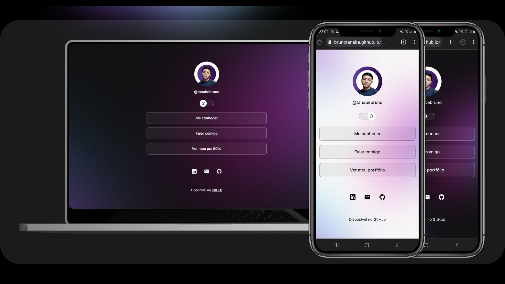

# 💼 Personal Portfolio Application 💼

## 📄 Overview 📄

This repository contains a personal portfolio application created by me. The application is a web page that showcases links to my main social networks. It features a responsive design and offers the option to switch between light and dark modes.

## 🛠️ Technologies Used 🛠️

- **HTML:** Page structure is created using HTML, defining the document structure and elements.

- **CSS:** Visual styling of the page is defined using CSS. Custom CSS variables are used to control colors, background images, and other visual aspects.

- **JavaScript:** Page interactivity is implemented using JavaScript. A JavaScript function is used to toggle between light and dark modes, altering the page style and profile image.

## 👥 Application Utility 👥

This personal portfolio application is useful for several purposes:

1. **Professional Presentation:** The page offers a centralized location to present information about the author, skills, and projects, which is crucial for professionals looking to share their knowledge and achievements.

2. **Demonstration of Technical Skills:** The application demonstrates the ability to create a responsive, stylized, and interactive web page using technologies such as HTML, CSS, and JavaScript.

3. **Project Portfolio:** Links to personal projects and social networks provide an easy way for visitors to explore the author's work and get in touch.

4. **Practical Learning:** Developing this application allows for the practical application of concepts learned in HTML, CSS, and JavaScript, enhancing web development skills.